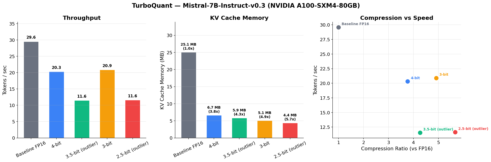
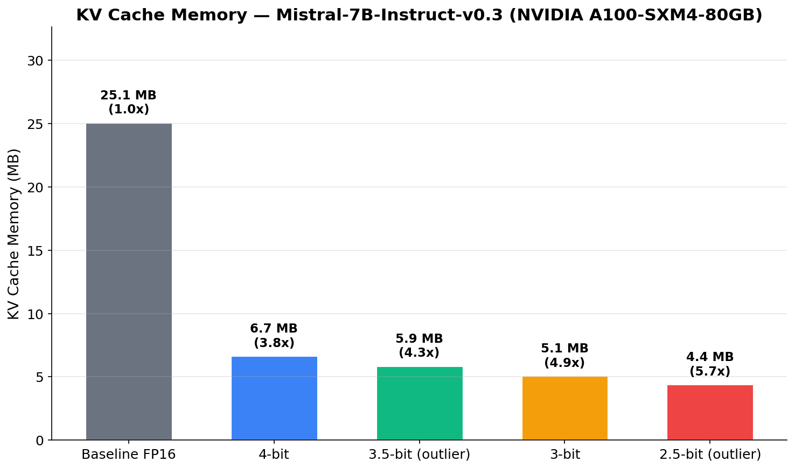
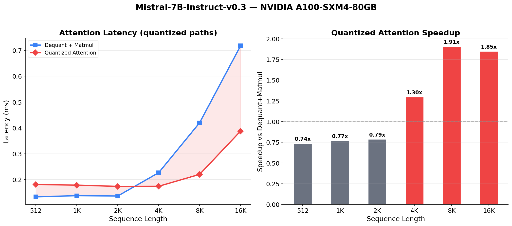
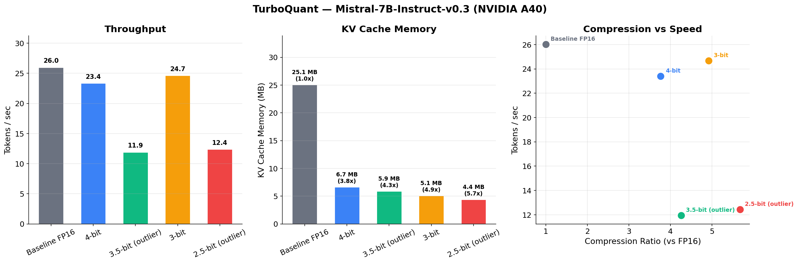
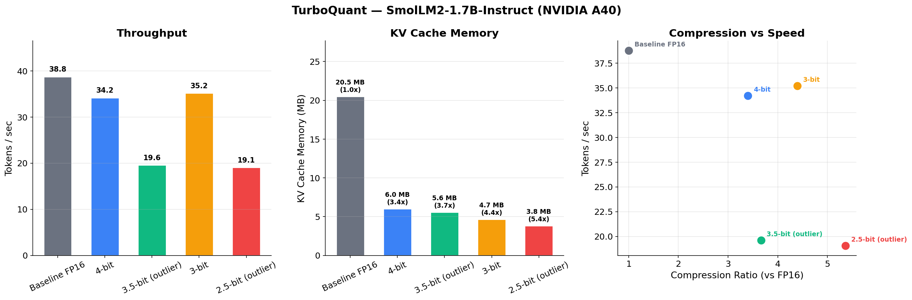

# TurboQuant

An open-source implementation of **TurboQuant** — the KV cache compression technique from Google Research. Compresses LLM KV caches to 2.5–4 bits per value with minimal quality loss, no training, and no calibration data.

> Zandieh, Daliri, Hadian, Mirrokni. *"TurboQuant: Online Vector Quantization with Near-optimal Distortion Rate"*
> ICLR 2026 — [arXiv:2504.19874](https://arxiv.org/abs/2504.19874) | [Google Research Blog](https://research.google/blog/turboquant-redefining-ai-efficiency-with-extreme-compression/)

## Results

### Mistral-7B-Instruct-v0.3 — NVIDIA A100-SXM4-80GB



- **3.8–5.7x memory compression** with matching generation quality at 4-bit and 3.5-bit
- At 3-bit and below, minor output differences appear but results remain coherent and correct
- **1.85x quantized attention speedup** vs dequantize-then-matmul at 16K sequence length

### KV Cache Memory (A100)



### Quantized Attention Speedup (A100)



### Mistral-7B-Instruct-v0.3 — NVIDIA A40



### SmolLM2-1.7B-Instruct — NVIDIA A40



### Algorithm Validation

All three algorithms pass 30/30 checks against the paper's theoretical error bounds:

| Algorithm | Metric | Measured | Paper Bound | Status |
|---|---|---|---|---|
| TurboQuantMSE (4-bit) | MSE | 0.0001 | ≤ 0.009 | PASS |
| TurboQuantMSE (3-bit) | MSE | 0.0003 | ≤ 0.030 | PASS |
| TurboQuantMSE (2-bit) | MSE | 0.0009 | ≤ 0.117 | PASS |
| TurboQuantProd | IP bias | < 0.001 | < 0.02 | PASS |

## What's Implemented

| Component | Paper Reference | File |
|---|---|---|
| `TurboQuantMSE` | Algorithm 1 — MSE-optimal quantizer via random rotation + Lloyd-Max | `turboquant/core.py` |
| `QJL` | Definition 1 — 1-bit Quantized Johnson-Lindenstrauss transform | `turboquant/core.py` |
| `TurboQuantProd` | Algorithm 2 — Unbiased inner-product quantizer (MSE + QJL) | `turboquant/core.py` |
| `TurboQuantCache` | KV cache with per-channel outlier-aware quantization (Section 4.3) | `turboquant/cache.py` |
| `TQLayerFused` | Cache layer exposing compressed indices for quantized attention | `turboquant/cache.py` |
| `QuantizedAttention` | Q@K^T directly on compressed indices without dequantization | `turboquant/attention.py` |
| `FusedQuantizedAttentionCUDA` | Triton kernel: centroid lookup + dot product fused | `turboquant/cuda_kernels.py` |
| Bit-packing | 2/3/4-bit indices packed into bytes for true memory savings | `turboquant/packing.py` |

### Per-Channel Outlier-Aware Quantization (Section 4.3)

For aggressive compression below 4 bits, channels with highest RMS magnitude get more bits:
- **2.5-bit effective**: 32 outlier channels at 3-bit, 96 regular at 2-bit (head_dim=128)
- **3.5-bit effective**: 32 outlier channels at 4-bit, 96 regular at 3-bit (head_dim=128)

## Quick Start

### Local (CPU / Apple Silicon MPS)

```bash
git clone https://github.com/OmarHory/turboquant.git
cd turboquant
python -m venv .venv && source .venv/bin/activate
pip install -r requirements.txt

python -m benchmarks.local
```

### GPU via RunPod

Spins up a GPU pod, runs benchmarks, prints results, and auto-terminates.

```bash
cp .env.example .env
# Add your RunPod API key and (optional) HuggingFace token

python -m benchmarks.gpu                              # SmolLM-1.7B on A40
python -m benchmarks.gpu --model mistral-7b           # Mistral-7B on A40
python -m benchmarks.gpu --model mistral-7b --gpu a100  # Mistral-7B on A100
```

### Validate Algorithms

```bash
python -m benchmarks.validate_algorithms
```

Runs 30 checks against the paper's theoretical bounds (MSE, inner-product error, bias, recall@k).

### Needle-In-A-Haystack Evaluation

```bash
python -m benchmarks.eval_needle --model mistralai/Mistral-7B-Instruct-v0.3
```

Tests retrieval accuracy across context lengths (4K–16K) and bit widths (baseline through 2.5-bit).

### LongBench-E Evaluation

```bash
python -m benchmarks.eval_longbench --model mistralai/Mistral-7B-Instruct-v0.3 --max-samples 25
```

Evaluates quantized KV cache quality across 12 long-context tasks (QA, summarization, code, etc.).

## How It Works

TurboQuant's core insight: a random orthogonal rotation transforms any input vector into a distribution where per-coordinate scalar quantization is provably near-optimal.

1. **Random Rotation** — Multiply by a random orthogonal matrix. Each coordinate of the rotated vector follows a known distribution, regardless of input data.

2. **Lloyd-Max Scalar Quantization** — Apply an optimal 1D quantizer per coordinate. The codebook is precomputed from the known distribution — no calibration needed.

3. **Per-Channel Outlier Separation** — For compression below 4 bits, channels with highest RMS magnitude get higher precision.

4. **Quantized Attention** — Rotate queries into quantization space and compute dot products via centroid lookups, avoiding full key dequantization.

```
Quantize:   x  →  Pi @ x  →  bucketize  →  uint8 indices (b bits/dim)
Attention:  Q  →  Q @ Pi^T →  matmul(centroids[idx])  →  scores
                  (rotate once)  (no full dequantize needed)
```

## Project Structure

```
turboquant/
├── turboquant/                   # Core package
│   ├── __init__.py
│   ├── core.py                   # TurboQuantMSE, QJL, TurboQuantProd
│   ├── cache.py                  # KV cache: TurboQuantLayer, TQLayerFused
│   ├── attention.py              # Quantized attention (skip dequantize)
│   ├── cuda_kernels.py           # Fused Triton CUDA kernels
│   └── packing.py                # Bit-packing for sub-byte indices
├── benchmarks/
│   ├── local.py                  # CPU/MPS benchmark
│   ├── gpu.py                    # RunPod GPU benchmark (multi-model, multi-GPU)
│   ├── validate_algorithms.py    # Paper bounds validation (30 checks)
│   ├── eval_needle.py            # Needle-In-A-Haystack evaluation
│   └── eval_longbench.py         # LongBench-E evaluation
├── scripts/
│   └── generate_charts.py        # Regenerate charts from result JSONs
├── assets/                       # Charts and figures
├── results/                      # Benchmark results (JSON)
├── .env.example
├── requirements.txt
└── LICENSE
```

## Limitations

- **Attention speedup is ~1.9x, not 8x.** The paper reports 8x. We achieve 1.85x on A100 at 16K sequence length. Achieving the full speedup likely requires the authors' optimized CUDA kernels, which were not released. Our implementation uses a Triton kernel for centroid lookup + dot product, which reduces memory bandwidth but doesn't match the paper's throughput.

- **Dense rotation matrix.** We use a full (D×D) random orthogonal matrix, matching the paper. Hadamard-based fast rotations would be a practical optimization for head_dim > 128.

- **Llama-3.1-8B not tested.** Llama-3.1-8B requires gated HuggingFace access. Results are from Mistral-7B-Instruct-v0.3 (same architecture class, similar scale).

## Citation

```bibtex
@inproceedings{zandieh2026turboquant,
  title={TurboQuant: Online Vector Quantization with Near-optimal Distortion Rate},
  author={Zandieh, Amir and Daliri, Majid and Hadian, Majid and Mirrokni, Vahab},
  booktitle={International Conference on Learning Representations (ICLR)},
  year={2026}
}
```

## License

MIT
